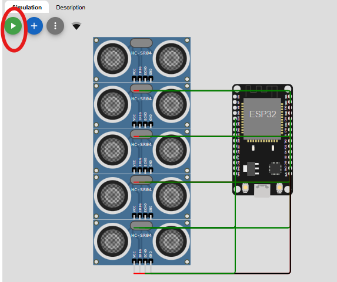
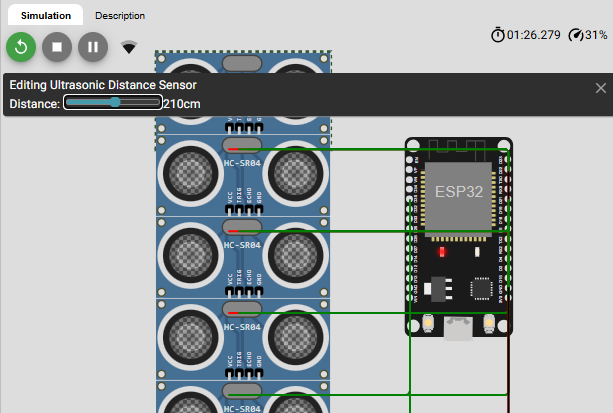

# SmartLine – Monitor Coda Supermercato ( al momento solo Conad Montefiore)

Misura coda alle casse con **ESP32 + sensori HC‑SR04** e visualizzazione via **dashboard web** in tempo reale via **MQTT**.

- Regola semplice: **ogni 50 cm ≈ 1 persona**.
- Pubblicazione **1 Hz** su broker pubblico, con **retain** per avere subito l’ultimo stato.
- Dashboard con **storico**, **barre per cassa**, e **tempo stimato per cassa** (2 min/persona)   visualizzato con **card + progress bar**.
- Supporto **multi‑sensore**: 5 casse con un solo ESP32 (un HC‑SR04 per cassa).
---

### Versione Multi sensore / 5 casse (stesso ESP32)
- 5 × HC‑SR04, uno per cassa.
- Pubblicazione di:
  - **Somma totale** persone (`queue_length`),
  - **array per cassa** (`casse`),
  - **ETA per cassa** (`casse_eta_min`, 2 min/persona),
  - **KPI tempo peggiore** (`estimated_time_min` = max delle casse),
  - **debug** distanze per cassa (`distance_cm`).
- **Dashboard aggiornata**: oltre alle barre per cassa, **griglia di card** con progress bar e badge colore (verde/giallo/rosso).

---

##  Architettura

```
[HC‑SR04 x5] → [ESP32] → (MQTT:1883) → [broker.hivemq.com]
                               │
                               └→ (MQTT over WSS:8884) → [Browser: dashboard web]
```

---

### NOTA IMPORTANTE 
 Per la simulazione del progetto SmartLine in configurazione multi-store, che prevede il monitoraggio delle code alle casse di tre supermercati distinti, sarebbe necessario disporre di tre unità ESP32, ciascuna collegata ai propri sensori a ultrasuoni (HC-SR04) e configurata per pubblicare i dati sul rispettivo topic MQTT (uno per ogni punto vendita).

In ambiente reale ciò riflette l’architettura distribuita prevista, nella quale ogni negozio dispone del proprio dispositivo di misura indipendente.

Tuttavia, nell’ambiente di simulazione Wokwi, la realizzazione di tale scenario richiederebbe la creazione di tre progetti separati, uno per ciascun supermercato, così da associare a ogni topic il proprio ESP32 virtuale. La limitazione principale risiede nel fatto che la versione gratuita di Wokwi consente la compilazione e l’esecuzione di un solo progetto alla volta, rendendo quindi non attuabile la simulazione contemporanea dei tre supermercati.

## Attualmente SmartLine risulta pienamente funzionante per il topic conad_montefiore, mentre per i supermercati famila_tdm e famila_gambettola rimane già predisposto il codice e le relative dashboard:

 # wokwi 
progetto/famila_tdm/stato
 https://wokwi.com/projects/441058599481755649

progetto/famila_gambettola/stato
https://wokwi.com/projects/441058803889206273


VSC:
smartline/public/famila_tdm.html
smartline/public/famila_gambettola.html

---

##  Avvio SmartLine

### 1) ESP32 su Wokwi
navigare sulla repository Wokwi al topic conad_montefiore:
https://wokwi.com/projects/441058920754091009
- Apri il progetto con **ESP32 DevKit v1** + **5 × HC‑SR04** (diagram già pronto).

- Avvia ▶ e apri il **Serial Monitor**: 



esempio output nel terminale:
  ```
  q_tot=9 | casse: 1 2 3 0 3 | eta[min]: 2.0 4.0 6.0 0.0 6.0 | dist: 60 110 170 40 230
  ```
Essendo una demo su Wokwi il sensore ad ultrasuoni non misura realmente la distanza, possiamo farlo manualmente muovendo lo slider distance.



##  Modifica valori da riga di comando (Serial Monitor)

I valori delle variabili possono essere modificati direttamente tramite comandi sul **Serial Monitor** (baud 115200).  
Questo permette di adattare il comportamento del sistema in tempo reale, senza ricompilare il firmware.

### 📋 Comandi disponibili

- Centimetri di distanza che corrispondono a 1 persona in coda 
```text
SET CM_PER_PERSON <valore>   # default: 50.0

- Zona iniziale (in cm) da ignorare vicino alla cassa
```text
SET OFFSET_CM <valore>       # default: 0.0

- Margine in cm per evitare che il conteggio oscilli vicino alle soglie
```text
SET HYSTERESIS_CM <valore>   # default: 5.0

- Tempo medio di servizio per persona (in minuti)
```text
SET MIN_PER_PERSON <valore>  # default: 2.0

- Mostrare i valori attuali di tutti i parametri

```text
SHOW


### 2) Dashboard web
Nella root del progetto Smartline/

  ```bash
  npm run dev
  ```
- Apri 

> smartline@1.0.0 dev
> node mqtt-server.js  

  La pagina si collega a `wss://broker.hivemq.com:8884/mqtt` e si iscrive al topic.

### 3) Simulazione
- In Wokwi **clicca ogni HC‑SR04** e muovi lo **slider distance**: ogni **~50 cm** aumenta di **1 persona** quella cassa.
- Nella dashboard: barre, card ETA e KPI si aggiornano in tempo reale.


le dashboard web (conad.html, famila_tdm.html, famila_gambettola.html) sono già pronte e configurate per sottoscriversi al relativo topic.


---

## 📡 Topic & payload

**Topic (retained):**  
```
progetto/conad_montefiore/stato
```

**Esempio payload (5 casse)**
```json
{
  "storeId": "conad_montefiore",
  "queue_length": 9,                // somma casse
  "estimated_time_min": 8.0,        // worst-case tra le casse
  "presence": true,
  "casse": [1, 2, 3, 0, 3],         // persone per cassa
  "casse_eta_min": [2, 4, 6, 0, 6], // minuti per cassa (2 min/persona)
  "distance_cm": [60, 110, 170, 40, 230], // debug
  "ts": 123
}
```

**Perché `retain=true`?**  
In questo modo la dashboard **vede subito** l’ultimo stato (non aspetta il prossimo publish).

---

## 🔌 Pin & Wiring (Wokwi, 5 sensori)

- **TRIG** (output): `{23, 19, 18, 5, 17}`  
- **ECHO** (input): `{22, 21, 4, 32, 35}`  

In `wokwi/diagram.json`, ogni HC‑SR04 ha un `attrs.distance` impostato (es. 60, 120, 180, 30, 150) per iniziare con valori validi.

> **Nota HW reale:** ECHO dell’HC‑SR04 è 5V → su ESP32 servirebbe **partitore/level shifter**. In Wokwi si può ignorare.

---

##  Dashboard (Smartline/conad_montefiore.html)

Tecnologie:
- **mqtt.js** (client MQTT via WSS)
- **Chart.js** (linea storico + barre per cassa)
- **UI ETA per cassa**: card con badge (verde/giallo/rosso) e progress bar proporzionale ai minuti.

KPI mostrati:
- **Persone in coda (totale)** = somma array `casse`
- **Tempo stimato (cassa peggiore)** = `max(casse_eta_min)`

---

## ⚙️ Parametri modificabili (firmware)

```cpp
const float CM_PER_PERSON   = 50.0f; // 50 cm → 1 persona
const float OFFSET_CM       = 0.0f;  // “zona morta” vicino alla cassa
const float HYSTERESIS_CM   = 5.0f;  // stabilità vicino alle soglie
const float MIN_PER_PERSON  = 2.0f;  // minuti per persona (ETA)
const uint8_t AVG_SAMPLES   = 5;     // media misure
```
- Più sensibile → abbassa `CM_PER_PERSON` (es. 40).
- Ignora i primi cm → alza `OFFSET_CM` (es. 20–30).
- Lettura “balla” → alza `HYSTERESIS_CM` (es. 8–10).
- Tempi diversi → cambia `MIN_PER_PERSON` (es. 3–4 min).

---

##  Troubleshooting

 # possibili errori all'avvio del progetto e relative correzioni:
- **`distance_cm: -1` o “FAIL” nel probe** → timeout: controlla **ECHO/TRIG/VCC/GND** e che in `diagram.json` ci siano le **distanze iniziali**.
- **Dashboard non si aggiorna**:
  - Topic identico (`progetto/conad_montefiore/stato`)
  - La rete non deve bloccare **WSS 8884** (se serve, provare da rete diversa).
- **Valori strani con 5 sensori**:
  - Testa col **probe** per isolare il sensore che non legge.
  - I pin **34/35/36/39** sono *input-only* quindi **ECHO**.

---

